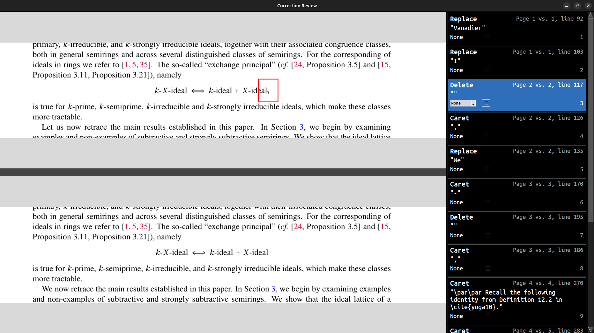

# `annin`
`annin` is a command-line tool that aids a LaTeX- and PDF-based manuscript correction workflow.[^1] Run 
```shell
annin pdf_file latex_file
```
to write annotations from the PDF as comments at their corresponding locations in the LaTeX.[^3]

Here's an example PDF annotation[^2]


It is written as a comment in the LaTeX as
```latex
$\mathbb E_1$-algebras %%
%% Annotation 4, page 2 [ ]
%% Delete: "in C[W−1]<SEL> </SEL>; on"
%% Comment:   ""
%% Replies: "make sure punct. outside inline math, too"
%%
%⭣ ⭣ ⭣ 
in $\mathsf C[\mathsf W^{-1}]~;$ on %%
%⭡ ⭡ ⭡  END of annotation 4
the right,
```
The comment includes
1. The annotation counter (`4`)---a running index that starts at 0
2. The page the annotation appears on (`2`). The number is absoluate, starting from 1 (not page label)
3. The annotation type (`Delete`)[^4]
4. The text selected by the annotation in the PDF (`"in C[W−1]<SEL> </SEL>; on"`)---the precise selection is between HTML-like focus tags and some surrounding text is included
5. The contents of the annotation comment box (`""`)
6. Any replies to the annotation (`"make sure punct. outside inline math, too"`).
   
The corresponding LaTeX is isolated to the region between the up and down arrows.

## Option: autocorrect
`annin` tries to automatically perform **three types of annotations** if the `--auto` option is supplied.[^5]
1. Replace
2. Strikeout (delete)
3. Insert (caret).

For the same example annotation, this results in
```latex
$\mathbb E_1$-algebras %%
%% Annotation 4, page 2 (AUTOCORRECTED) [ ]
%% Delete: "in C[W−1]<SEL> </SEL>; on"
%% Comment:   ""
%% Replies: "make sure punct. outside inline math, too"
%%
%⭣ ⭣ ⭣ 
in $\mathsf C[\mathsf W^{-1}];$ on %%
%⭡ ⭡ ⭡  END of annotation 4
the right,
```

## Installation
If you don't already have a LaTeX distribution, go to https://www.latex-project.org/get/ or https://www.tug.org/texlive/.
### Linux/Mac
1. Install pixi (the python package and dependency manager): https://pixi.prefix.dev/latest/installation/
2. Install `diff-pdf` (CL tool for comparing PDFs): https://github.com/vslavik/diff-pdf
3. Clone this repository to your machine
4. Run `./install.sh [annin shell script install directory]` (e.g., `./install.sh /usr/local/bin/`) at the top-level directory of the cloned repository.

Verify it is installed properly with `annin -h`. You should see the usage message. If the directory you installed it to is on your PATH, you can run `annin` anywhere on your machine.
### Windows
No instructions currently.

## Assumptions and limitations
### PDF generated by LaTeX and LaTeX unchanged
It might be obvious, but the PDF supplied to `annin` must have been generated by the supplied LaTeX file.

Also, the LaTeX file should be unchanged from when it generated the PDF which was then annotated. Even relatively small changes could effect pagination and cause a cascade of differences between what the source now renders and the original PDF. Such differences prevent PDF positions from correctly mapping to the LaTeX, so snippets no longer correspond to the selected text.

If the PDF the current LaTeX generates and the annotated PDF are out of sync only up to a certain page, the `--tex-start` option might be of use.

### Annotations are precise (for autocorrections)
The selected text and contents of the comment box are interpreted literally, so correct autocorrections can only happen if the annotations themselves are correct. It might also be worth reiterating that annotations outside the listed three types will **never be performed automatically**. For more on how to use PDF annotations for best results with this tool, see [notes/annotation_guidelines.md](notes/annotation_guidelines.md).

### Incomplete character maps
Complicated math formulas render beautifully with LaTeX, but their character encoding in the PDF is not great. Take for example this LaTeX
```latex
\begin{equation}
X \mapsto \coprod_{n \geq 0} X^{\otimes n}
\end{equation}
```
it looks like 


in the PDF, but extracting the text from that same PDF only gives
```text
X 7→
 a
 X ⊗n
n≥0
```

Ideally, the text would look something like
```text
𝑋 ↦ ∐_{𝑛≥0} 𝑋^{⊗𝑛}
```
Such a problem is well outside the scope of the tool. There might be a way to improve the PDF encoding for math glyphs using compilers other than `pdflatex` like `lualtex`.

# `vercorr`
`vercorr` is a tool to be used after `annin` to again aid a LaTeX- and PDF-based manuscript correction workflow. Run
```shell
vercorr pdf_file latex_file
```
and a set of before/after images for each annotation are displayed. The before image comes from the annotated PDF, the after from the PDF generated by the `latex_file`.



The annotations are displayed in the panel on the right, and when you click on one it is highlighted and its corresponding pair of images appears. You can also set the status and checkmark of the annotation like in Adobe Acrobat by either clicking the status dropdown or checkmark box.

Each annotation lists the page in the annotated PDF versus the one generated by the LaTeX source along with its line number.

When the program is closed, it will write a file named `[pdf_file]-vercorr.pdf` which saves any changes made to the annotation checkmarks or statuses.[^6]

## Shortcuts
There are a handful of single key shortcuts while interacting with the GUI. They effect/are relative to the current highlighted annotation.
| Key | Action              |
|-----|---------------------|
| `n` | Next annotation     |
| `p` | Previous annotation |
| `m` | Check/uncheck       |
| `d` | Status "None"       |
| `r` | Status "Rejected"   |
| `a` | Status "Accepted"   |
| `c` | Status "Completed"  |
| `x` | Status "Cancelled"  |

## Requirements
`vercorr` can only be used after `annin`, not on it's own. `annin` writes a `.annin` file that saves its work so `vercorr` doesn't need to write the annotations in the LaTeX source again. It uses the `.annin` to sync annotations to corresponding lines of LaTeX.

## Installation
There are no new dependencies from what `annin` required. You can either 
1. run `./vercorr_install.sh [installation directory]` in the top-level repository directory. Or
2. add the following alias to your shell configuration script (e.g., `~/.bashrc`, `~/.zshrc`)
```shell
alias vercorr="pixi run --manifest-path /absolute/path/to/annin/repository/ vercorr"
```
Then run `vercorr -h` to verify it is installed correctly. 


[^1]: For more about the project's context and motivation, see [notes/about.md](notes/about.md).
[^2]: Recall that a `~` in LaTeX produces a non-breaking space, but spaces aren't written before punctation like a semicolon, so the edit is to close up that space.
[^3]: `annin` does not overwrite the original LaTeX---it creates a modified version of it, `[latex_file]_inlined.tex`. Also, `annin` verifies that the modified version is visually identical to the original `latex_file`. The inserted comments should never produce visual differences.
[^4]: This annotation is typically called "Strikeout" or "Strikethrough".
[^5]: The same `_inlined.tex` file is created in addition to `_autocorrected.tex`.
[^6]: Statuses and checkmarks are not an established PDF feature. Different PDF viewers/editors implement them differently. `vercorr` tries to follow Adobe Acrobat's (2020) implementation, which is rather unusual. For example, statuses and checkmarks are, under the hood, hidden text annotations with additional properties---Model and StateModel---and despite checkmarks only appearing to the individual user who created them while statuses are seen by all users, statuses are written *in reply* to the checkmark. Those curious can find more about these implementation details in the commit logs. Look from [bbf52ba](https://github.com/charleskolozsvary/annin/commit/bbf52ba348be00775423380c2284253cde60c833) and later. 
